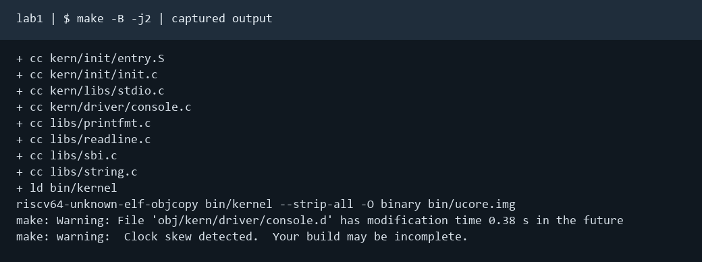
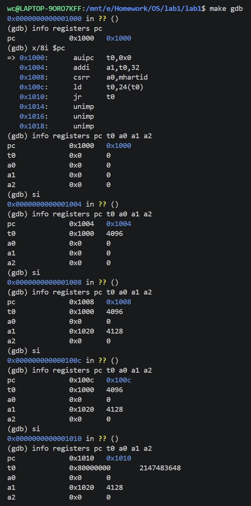
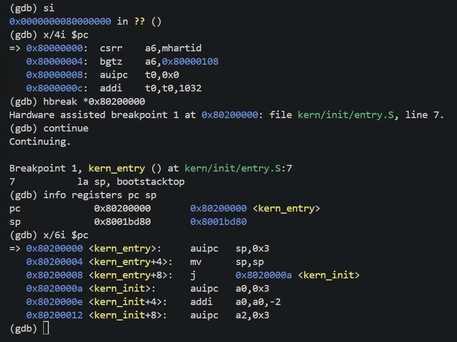
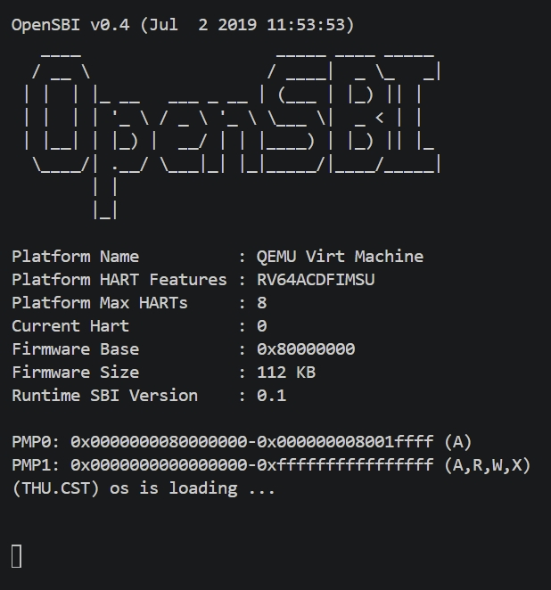

# 操作系统实验报告

## 实验基本信息

| 项目 | 内容 |
|------|------|
| **实验名称** | Lab 1：比麻雀更小的麻雀（最小可执行内核） |
| **小组成员** | 2412449-石晨昊、2410966-王策、2410668-吕昊远 |
| **完成日期** | 2026-10-10 |

### 小组分工

练习与模块分工：

| 成员 | 负责的练习/模块 |
|------|----------------|
| 2412449-石晨昊 | 练习一 |
| 2410966-王策 | 练习二 |
| 2410668-吕昊远 | 练习二 |

实验报告分工：

| 成员 | 报告职责 |
|------|----------|
| 2412449-石晨昊 | 实验目的、整体逻辑、练习一和对应 OS 原理知识点 |
| 2410966-王策 | 实验总结 |
| 2410668-吕昊远 | 练习二过程、测试与验证、运行图片、报告整合 |

---

## 一、实验目的

本实验的主要目的是：

1. 使用 链接脚本 描述内存布局
2. 进行 交叉编译 生成可执行文件，进而生成内核镜像
3. 使用 OpenSBI 作为 bootloader 加载内核镜像，并使用 Qemu 进行模拟
4. 使用 OpenSBI 提供的服务，在屏幕上格式化打印字符串用于以后调试

---

## 二、实验环境

| 项目 | 实际环境 |
|------|----------|
| 宿主系统 | Windows，使用 WSL 2 的 CompilerLab |
| 目标平台 | QEMU virt，64 位 RISC-V，单 hart，128 MiB |
| 交叉编译器 | riscv64-unknown-elf-gcc 15.1.0 |
| 调试器 | riscv64-unknown-elf-gdb 16.3.90.20250610-git |
| 模拟器 | QEMU 4.1.1 |
| 固件 | OpenSBI 1.0，Runtime SBI 0.3 |
| ELF 属性 | ELF64、RISC-V、RVC、double-float ABI，入口 0x80200000 |
| 验证工具 | GNU make、Python 3 |

小组使用的 AI 工具：

| 成员 | AI 编程工具 | 底层模型 | 备注 |
|------|------------|---------|------|
| 2412449-石晨昊 | Codex | GPT-6.1 sol | 无 |
| 2410966-王策 | Codex | GPT-6.1 sol | 无 |
| 2410668-吕昊远 | Codex | GPT-6.1 sol | 无 |

---

## 三、实验整体逻辑分析

### 2.1 本章节的逻辑主线

Lab1主要是执行最小内核，并理解从机器启动到操作系统运行的过程。与普通程序不一样的是，内核刚取得控制权时没有现成的进程栈或 C 运行时入口，必须依靠链接脚本指定地址，再由入口汇编建立栈环境，之后才能调用 C 函数。

启动路径可以概括为：QEMU 复位地址 0x1000 → 复位 ROM → OpenSBI 入口附近 0x80000000 → 内核入口 kern_entry（0x80200000）→ kern_init → 清理 BSS 对应区间 → 控制台输出 → 循环。不同阶段各有分工：QEMU 负责虚拟硬件及镜像装载，复位 ROM 准备启动参数并转入固件，OpenSBI 配置更高特权级的运行环境，最终将执行权交给 S-mode 内核。

本实验主要涉及以下三个方面的内容：

1. **内核的加载与启动。** 理解 QEMU、复位代码和 OpenSBI 在启动过程中的不同作用，以及链接脚本如何确定内核各个段的内存布局和程序入口，使内核镜像能够被加载到预定位置并正确执行。
2. **内核代码与内存地址的对应关系。** 理解地址相关代码的特点，以及编译、链接过程中确定的地址与程序实际运行地址之间的关系。本实验将内核入口安排在物理地址 `0x80200000`，因此需要保证镜像的实际加载位置与链接时确定的地址布局一致，避免因地址不匹配导致程序无法正常运行。
3. **内核的基本输出机制。** 在操作系统尚未建立完整运行环境时，内核不能直接依赖普通应用程序使用的标准库输出机制。本实验通过已有的控制台输出函数，将格式化输出逐层转换为字符输出，并利用 `ecall` 指令请求 OpenSBI 提供的 M-mode 服务，最终实现 `cprintf` 的格式化信息输出。

### 2.2 功能的逐步实现

本次实验主要任务是理解代码：

阅读 tools/kernel.ld，确认入口符号及链接地址与镜像预期装载位置一致。
阅读 kern/init/entry.S，理解汇编入口如何建立内核栈、转入 kern_init。
结合 kern/init/init.c 分析 BSS 初始化、启动信息打印与循环不返回的原因。
用 QEMU 运行已有镜像，再使用 GDB 对照启动阶段的实际指令、PC 与 sp 值。

---

## 四、实验内容与实现

### 练习一：理解内核启动中的程序入口操作

**负责人：** 2412449-石晨昊 2410966-王策

#### 模块功能描述

**涉及的函数与符号：**

~~~c
int kern_init(void) __attribute__((noreturn));
void *memset(void *s, char c, size_t n);
int cprintf(const char *fmt, ...);
/* kern_entry、bootstack、bootstacktop 是汇编符号。 */
~~~

kern_entry 负责建立栈、设好栈指针，然后直接跳进 kern_init。kern_init 则负责清零 [edata, end) 的 BSS，再调用 cprintf 打印启动信息，之后便进入死循环，不再返回。

**la sp, bootstacktop 完成什么操作，目的是什么？**

la 是加载地址的伪指令，功能是把 bootstacktop 这个符号的地址写入 sp。此处取的是符号地址，不是该位置保存的数据。bootstack 在 entry.S 中预留了两页，共 8192 字节；栈向低地址增长，因此空栈时 sp 指向预留的空间的最高处，且满足 16 字节对齐。

它的目的是在进入 C 代码之前建立栈，从而支持 C 函数的局部变量、寄存器保存、返回地址保存和函数调用这些功能。编译器生成的序言可能第一条指令就要用到栈，因此必须先于 C 入口执行，在 C 代码之前完成。在 kern_init 第一条机器指令处，GDB 可以读到 sp = bootstacktop = 0x80203000，bootstack = 0x80201000，差值为 0x2000，与预留的两页栈空间一致。

**tail kern_init 完成什么操作，目的是什么？**

tail kern_init 是尾调用形式的跳转伪指令：它将下一阶段执行位置设为 kern_init，不会像 call 把新的返回位置写入 ra。因为汇编入口只负责准备执行环境，进入内核初始化后不存在需要返回的调用者。框架中的 kern_init 标记为 noreturn，运行到末尾也不会返回 kern_entry。

#### 实现迭代过程

##### 第一次迭代

**遇到的问题：** 早期的代码提供方式有误，导致 AI 自己编写了一个独立内核，其 C 入口地址和伪指令展开均不适用于本次实验提供的框架。

**问题解决策略：** 重新读取当前 bin/kernel 的反汇编，在函数第一条指令设置硬件断点，避免把执行过 C 序言后的 sp 当作初始栈顶。

**最终结果：** 理解了两条指令的作用；确认 kern_entry = 0x80200000，kern_init = 0x8020000a，内核栈初始化完成后的 sp = 0x80203000。

---

### 练习二：使用 GDB 验证启动流程

**负责人：** 2410668-吕昊远，2410966-王策

#### 模块功能描述

本练习中无需修改代码。

#### 实现迭代过程

无

#### 调试过程、观察结果和问题解答

我们在 `lab1` 目录下打开两个终端。第一个终端运行 `make debug`，让 QEMU 启动等待调试器连接；第二个终端运行 `make gdb`，启动 RISC-V GDB，加载内核 ELF 文件 `bin/kernel`，并通过 `localhost:1234` 连接 QEMU，以便观察 CPU 的指令执行情况和寄存器状态。

**1. 观察 CPU 加电后的初始状态**

连接成功后，首先执行 `info registers pc`，查看程序计数器的初始值。GDB 显示 `pc = 0x1000`，说明 QEMU 模拟的 RISC-V CPU 从地址 `0x1000` 开始执行复位代码。

随后使用 `x/8i $pc` 查看当前地址附近的汇编指令，并通过 `si` 逐条执行指令。我们在每执行一条指令后，使用 `info registers pc t0 a0 a1 a2` 观察寄存器的变化。

观察到的指令及其执行结果如下：

| 地址     | 指令              | 功能及观察结果                                               |
| -------- | ----------------- | ------------------------------------------------------------ |
| `0x1000` | `auipc t0,0x0`    | 根据当前 PC 计算地址并保存到 `t0`，执行后 `t0 = 0x1000`，PC 更新为 `0x1004`。 |
| `0x1004` | `addi a1,t0,32`   | 将 `t0` 加上 32，得到 `a1 = 0x1020`，用于向后续固件传递设备树地址。 |
| `0x1008` | `csrr a0,mhartid` | 读取当前硬件线程编号，观察到 `a0 = 0`，说明当前执行的是 hart 0。 |
| `0x100c` | `ld t0,24(t0)`    | 从地址 `0x1018` 读取下一阶段固件的入口地址，执行后 `t0 = 0x80000000`。 |
| `0x1010` | `jr t0`           | 跳转到 `t0` 保存的地址，执行后 PC 变为 `0x80000000`，进入 OpenSBI。 |

通过逐条执行，可以看到 CPU 首先获取复位代码附近的地址，随后准备设备树地址、读取当前硬件线程编号，最后取得 OpenSBI 的入口地址并完成跳转。

**2. 跟踪 CPU 进入 OpenSBI**

当 CPU 执行 `0x1010` 处的 `jr t0` 后，GDB 显示当前地址变为 `0x80000000`。

此时执行 `x/4i $pc` 查看 OpenSBI 入口附近的汇编指令，观察到：

- `0x80000000: csrr a6,mhartid`
- `0x80000004: bgtz a6,0x80000108`
- `0x80000008: auipc t0,0x0`
- `0x8000000c: addi t0,t0,1032`

第一条指令再次读取硬件线程编号，第二条指令根据编号进行条件跳转。说明 CPU 已经进入 OpenSBI 固件的启动代码。

**3. 验证内核入口地址**

我们在 GDB 中输入 `hbreak *0x80200000`，在内核入口设置硬件执行断点，随后执行 `continue`，使 CPU 继续运行。

GDB 最终在 `kern_entry` 处触发断点，显示：

- 断点位置：`kern/init/entry.S:7`
- `pc = 0x80200000`
- `sp = 0x8001bd80`

说明 OpenSBI 完成控制权移交，CPU 到达内核入口 `0x80200000`，将执行内核第一条指令。

使用 `x/6i $pc` 查看内核入口附近的汇编代码，观察到：

- `0x80200000: auipc sp,0x3`
- `0x80200004: mv sp,sp`
- `0x80200008: j 0x8020000a <kern_init>`

前两条机器指令对应 `entry.S` 中的 `la sp, bootstacktop`，用于设置内核启动栈指针；第三条指令对应 `tail kern_init`，用于跳转到 C 语言编写的内核初始化函数。

**4.RISC-V 硬件加电后最初执行的几条指令位于什么地址？它们主要完成了哪些功能？**

CPU 加电复位后，程序计数器被初始化为 `0x1000`，最初执行的指令位于从 `0x1000` 开始的复位代码区域。

CPU 首先执行 `auipc` 指令获取当前代码附近的地址，然后通过 `addi` 指令准备设备树地址，使用 `csrr` 指令读取 `mhartid` 寄存器以获取当前硬件线程编号，然后利用 `ld` 指令读取 OpenSBI 的入口地址，最后通过 `jr` 指令跳转到 `0x80000000`。

主要功能是准备固件启动所需的参数，并将 CPU 的控制权从复位代码移交给 OpenSBI。

进入 OpenSBI 后，固件进一步初始化运行环境，并将控制权交给操作系统内核。GDB 在 `0x80200000` 成功命中内核入口断点，验证了 CPU 从复位地址到内核入口的启动流程。

---

### Challenge

本次实验中无 Challenge 题目

---

## 五、测试与验证

**测试运行截图：**

1.在实验目录执行 `make -B -j2`，通过 Makefile 完成源代码编译、目标文件链接以及内核镜像生成。

2.使用 `make debug` 启动 QEMU，并通过 `make gdb` 连接调试器。GDB 显示 CPU 初始 PC 为 `0x1000`。随后通过 `x/8i $pc` 和 `si` 查看并逐条执行复位代码，观察相关寄存器的变化。

3.执行复位代码最后的跳转指令后，CPU 进入 OpenSBI 入口 `0x80000000`。在 `0x80200000` 设置硬件执行断点并继续运行，GDB 成功在 `kern_entry` 处暂停，确认 CPU 到达内核入口。

4.在 GDB 中继续运行后，QEMU 终端显示 OpenSBI v0.4 的启动信息，并输出 `(THU.CST) os is loading ...`，说明内核能够继续执行初始化及控制台输出代码。

通过上述实验，验证了 CPU 从复位地址 `0x1000` 开始执行，经过 OpenSBI 固件，最终进入内核入口 `0x80200000` 的启动过程。

---

## 六、实验总结与收获

### 对操作系统的理解

**重要知识点及其与 OS 原理的关系、差异：**

| **知识点**                | **含义**                                                     | **对应 OS 原理及关系、差异**                                 |
| ------------------------- | ------------------------------------------------------------ | ------------------------------------------------------------ |
| **Bootloader 与 OpenSBI** | OpenSBI 是 RISC-V 平台上的底层固件，运行在 M-mode，负责初始化处理器的基本运行环境，并将控制权交给操作系统内核。 | 对应操作系统的引导过程。内核无法在硬件加电后直接运行，需要先由固件完成必要的初始化。本实验中，CPU 从复位地址 `0x1000` 开始执行，随后进入 OpenSBI，最终跳转到 `0x80200000` 执行内核。与真实计算机相比，QEMU 简化了硬件检测和启动设备管理等过程。 |
| **链接脚本与内存布局**    | 链接脚本规定程序入口地址，以及代码段、数据段等在内存中的排列方式。本实验通过 `kernel.ld` 将内核入口设置在 `0x80200000`。 | 对应程序装载与内存地址管理。链接脚本确定程序在链接阶段使用的地址布局，而加载器负责将程序放入相应的内存位置。两者需要相互配合，才能保证指令和数据被正确访问。本实验采用相对固定的内存布局，尚未涉及完整操作系统中的虚拟地址空间管理。 |
| **内核栈初始化**          | 在 `entry.S` 中，通过 `la sp, bootstacktop` 将栈指针设置为预留的内核栈顶，为后续 C 语言函数执行提供栈空间。 | 对应函数调用机制和 RISC-V ABI。函数执行通常需要栈来保存局部变量、返回地址和部分寄存器。普通应用程序的初始栈由运行环境准备，而本实验中的内核必须自行建立启动栈。此外，该实验只有一个初始内核栈，尚未涉及多进程或多线程的独立栈管理。 |
| **SBI 与 `ecall` 指令**   | SBI 是 RISC-V 操作系统与底层固件之间的标准接口。运行在 S-mode 的内核通过 `ecall` 指令请求 M-mode 的 OpenSBI 提供控制台输出等服务。 | 对应处理器特权级管理与系统调用机制。两者都利用异常机制实现不同特权级之间的受控交互，但调用层次不同：用户态系统调用通常是 U-mode 请求 S-mode 内核服务，而 SBI 调用是 S-mode 内核请求 M-mode 固件服务。本实验通过字符输出展示了这一机制。 |

**OS 原理中重要但本实验没有覆盖的知识点：**

对于一个功能完备的操作系统来说，lab1还没有进程管理、CPU 调度、虚拟内存与页面置换、用户态系统调用、并发同步及文件系统这些重要的功能。本次实现的“最小可执行内核”仅仅建立了后续实验启动和调试的基础，尚不具备完整功能，距离完整的操作系统还很遥远。

**AI 协作学习的经验**

通过本次实验，我们总结了以下几点使用 AI 辅助学习的经验：

1. 使用 AI 分析实验代码时，应提供完整的相关源码和实验要求，避免因为上下文不足而得到不适用于当前项目的解释。
2. 对于汇编指令和寄存器变化，不能只依赖 AI 的分析，还需要通过 GDB 的实际输出进行验证。
3. 不同版本的 QEMU 和 OpenSBI 可能具有不同的启动代码和运行结果，因此应以本次实验环境中的实际观察为准。
4. 编译成功不代表内核能够正常启动，需要结合 QEMU 的运行输出和 GDB 的断点调试，判断程序是否真正执行到内核入口。

---
