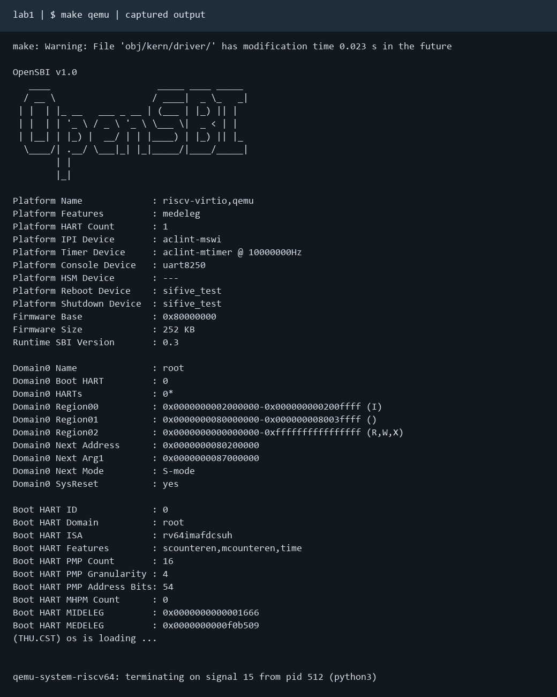
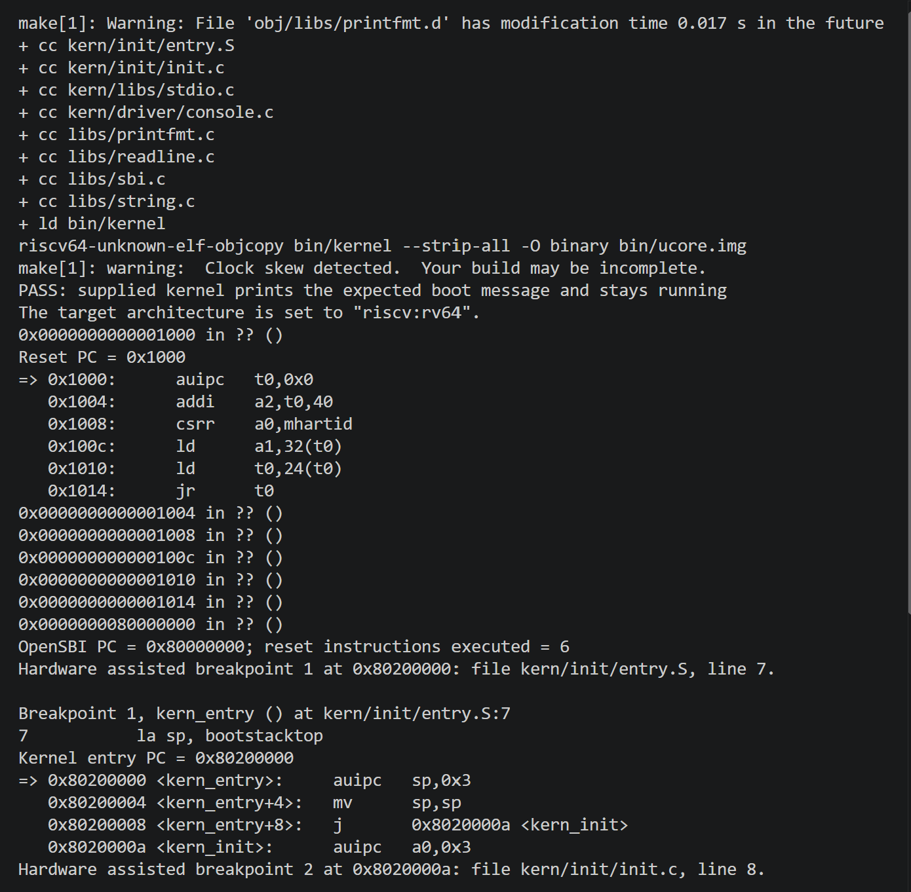
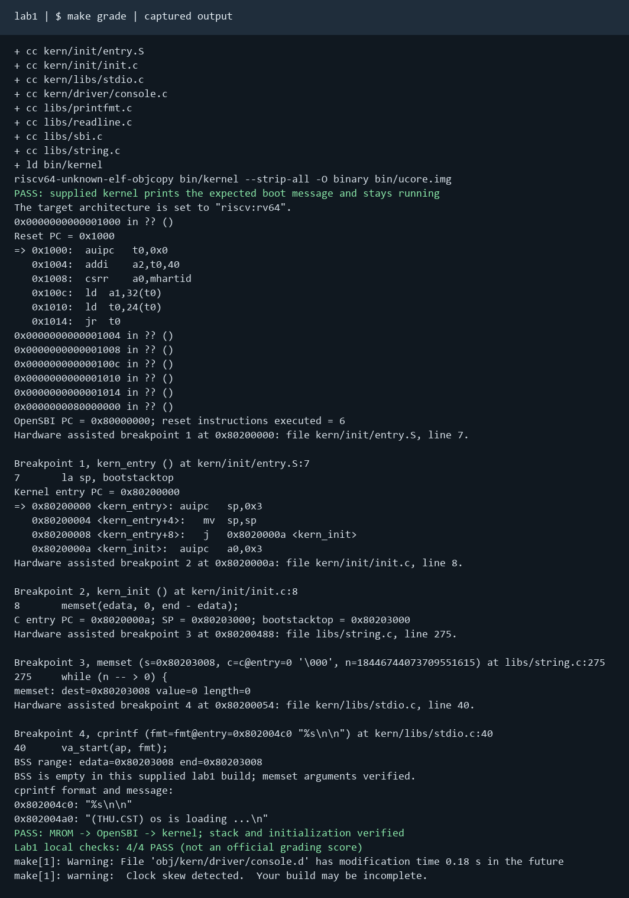

# 操作系统实验报告

## 实验基本信息

| 项目 | 内容 |
|------|------|
| **实验名称** | Lab 1：比麻雀更小的麻雀（最小可执行内核） |
| **小组成员** | 2412449-石晨昊、2410966-王策、2410668-吕昊远 |
| **完成日期** | 2026-10-10 |

### 小组分工

练习与模块分工：

| 成员 | 负责的练习/模块 |
|------|----------------|
| 2412449-石晨昊 | 练习一：入口汇编、启动栈、链接布局与 C 初始化分析 |
| 2410966-王策 | SBI 约束修正、输入接口补齐、输出链与构建流程核对 |
| 2410668-吕昊远 | 练习二：QEMU/GDB 跟踪、验证脚本、日志及运行结果整理 |

实验报告分工：

| 成员 | 报告职责 |
|------|----------|
| 2412449-石晨昊 | 实验目的、整体逻辑、练习一和对应 OS 原理知识点 |
| 2410966-王策 | 环境、SBI 修改说明、提示词和 AI 协作经验 |
| 2410668-吕昊远 | 练习二过程、测试与验证、运行图片、报告整合 |

---

## 一、实验目的

本实验的主要目的是：

1. 理解 RISC-V 从 QEMU 复位桩、OpenSBI 到 S-mode 内核的启动交接。
2. 理解链接脚本、ELF、裸镜像，以及栈和 BSS 对 C 运行环境的作用。
3. 理解 cprintf 经控制台封装到 SBI ecall 的格式化输出链。
4. 使用 GDB 观察实际指令、地址和寄存器等信息，以真实结果验证 AI 的实现。

---

## 二、实验环境

| 项目 | 实际环境 |
|------|----------|
| 宿主系统 | Windows，使用 WSL 2 的 CompilerLab |
| 目标平台 | QEMU virt，64 位 RISC-V，单 hart，128 MiB |
| 交叉编译器 | riscv64-unknown-elf-gcc 15.1.0 |
| 调试器 | riscv64-unknown-elf-gdb 16.3.90.20250610-git |
| 模拟器 | QEMU 7.0.0 |
| 固件 | OpenSBI 1.0，Runtime SBI 0.3 |
| ELF 属性 | ELF64、RISC-V、RVC、double-float ABI，入口 0x80200000 |
| 验证工具 | GNU make、Python 3 |

小组使用的 AI 工具：

| 成员 | AI 编程工具 | 底层模型 | 备注 |
|------|------------|---------|------|
| 2412449-石晨昊 | Codex | GPT-5.6 sol | 无 |
| 2410966-王策 | Codex | GPT-5.6 sol | 无 |
| 2410668-吕昊远 | Codex | GPT-5.6 sol | 无 |

---

## 三、实验整体逻辑分析

### 2.1 本章节的逻辑主线

本章围绕“让第一段内核代码在处理器上正确运行”这一核心问题展开。具体流程上，内核不能依赖宿主操作系统提供的进程栈、标准库或启动例程，需要确定加载地址、准备栈并建立 C 初始化环境。固件先完成机器环境初始化，再把控制权交给内核；内核打印信息，再由调试器验证各阶段是否真正执行。

主线是：复位 0x1000 → MROM → OpenSBI 0x80000000 → kern_entry 0x80200000 → kern_init → BSS 初始化 → cprintf 输出 → 无限循环。

### 2.2 功能的逐步实现

1. 首先核对 tools/kernel.ld，确定段布局和入口地址，这是固件找到并执行内核的基础。
2. 接着理解 entry.S，建立启动栈后转入 C，保证编译后的函数能安全使用栈。
3. 然后理解 init.c，清零 edata/end 标识的范围，调用已有格式化输出链。
4. 核对 SBI 的编译器约束并补齐输入包装函数，使框架已有接口完整。
5. 最后生成原框架镜像，通过 QEMU 和 GDB 验证启动，补齐缺失的本地 grade 脚本。

实验源码框架中提供的 entry.S、init.c、console.c、stdio.c、printfmt.c、string.c 和链接脚本均保持不变。原文件中仅修改 Makefile 和 libs/sbi.c，其余改动仅有额外增加的验证与文档。

---

## 四、实验内容与实现

本部分按练习一、相关 SBI 模块、练习二组织。各模块的提示词按照课程模板编写，采用 [PROMPT]、[RELY]、[GUARANTEE]、[SPECIFICATION] 四部分结构，遵循 [四段式规范](http://8.135.34.58/lab2026/_book/lab0.5/3_prompt_structure.html)。

### 练习一：理解内核启动中的程序入口操作

**负责人：** 2412449-石晨昊

#### 模块功能描述

**涉及的函数与符号：**

~~~c
int kern_init(void) __attribute__((noreturn));
void *memset(void *s, char c, size_t n);
int cprintf(const char *fmt, ...);
/* kern_entry、bootstack、bootstacktop 是汇编符号。 */
/* edata、end 由链接脚本提供。 */
~~~

kern_entry 负责建立栈、设好栈指针，然后直接跳进 kern_init。kern_init 则负责清零 [edata, end) 的 BSS，再调用 cprintf 打印启动信息，之后便进入死循环，不再返回。

**la sp, bootstacktop 完成什么操作，目的是什么？**

la 是加载地址的伪指令，功能是把 bootstacktop 这个符号的地址写入 sp。此处取的是符号地址，不是该位置保存的数据。bootstack 在 entry.S 中预留了两页，共 8192 字节；栈向低地址增长，因此空栈时 sp 指向预留的空间的最高处，且满足 16 字节对齐。

它的目的是在进入 C 代码之前建立栈，从而支持 C 函数的局部变量、寄存器保存、返回地址保存和函数调用这些功能。编译器生成的序言可能第一条指令就要用到栈，因此必须先于 C 入口执行，在 C 代码之前完成。该指令在框架中实际展开为：

~~~asm
0x80200000: auipc sp,0x3
0x80200004: mv    sp,sp
~~~

在 kern_init 第一条机器指令处，GDB 可以读到 sp = bootstacktop = 0x80203000，bootstack = 0x80201000，两者差值恰好为 0x2000，与预留的两页空间完全一致。

**tail kern_init 完成什么操作，目的是什么？**

tail 是尾调用伪指令，把控制权转移到 kern_init，不会为返回 kern_entry 建立新的返回地址；这也与不返回的内核入口设计约定相符。kern_init 标记为 noreturn，输出信息后无限循环。

因此，链接器会把这条伪指令松弛为一条普通跳转，本次实际展开为：

~~~asm
0x80200008: j 0x8020000a <kern_init>
~~~

该指令不会涉及 ra。此外还需注意的是，这类伪指令的展开形式会随工具链和链接设置变化，此前开发过程中错误地使用了非框架的 auipc/jr 写法，地址和形式都产生了一定的差异。

#### 最终提示词

~~~~markdown
[PROMPT]
任务：阅读提供的 code/kern/init/entry.S、kern/init/init.c、kern/mm/mmu.h、kern/mm/memlayout.h 和 tools/kernel.ld，在 report/report.md 完成练习一。
操作要求：必须修改实际报告文件，保留这些已有的启动代码，不另写一套内核；结合实际反汇编解释源码。
输出要求：回答 la sp, bootstacktop 与 tail kern_init 的操作和目的，说明栈、调用约定及伪指令展开。

[RELY]
#define PGSIZE 4096
#define PGSHIFT 12
#define KSTACKPAGE 2
#define KSTACKSIZE (KSTACKPAGE * PGSIZE)
入口符号 kern_entry，链接地址 0x80200000，栈符号 bootstack、bootstacktop。
int kern_init(void) __attribute__((noreturn));
void *memset(void *s, char c, size_t n);
int cprintf(const char *fmt, ...);
edata、end 来自提供的链接脚本。

[GUARANTEE]
报告回答两条指令的作用和目的，并说明 kern_entry、kern_init、memset 和 cprintf 的关系。
保持已有函数签名，不把符号地址与符号处的数据混为一谈。

[SPECIFICATION]
kern_entry：
Pre-Condition：固件已移交控制权，内核还未建立自己的 C 栈。
Post-Condition：解释 C 入口之前 sp 等于 bootstacktop，16 字节对齐，栈向低地址增长。
Requirements：说明为何必须先建立栈，再执行 C 代码。

tail：
Pre-Condition：栈已建立，kern_init 不返回。
Post-Condition：解释控制权转移及不建立返回入口的新返回地址；给出本次实际展开。
Requirements：区分源码伪指令与随工具链、链接配置变化的机器指令。

kern_init：
Pre-Condition：栈与链接符号有效。
Post-Condition：解释清零 [edata,end)、输出信息与无限循环。
Requirements：不能清零正在使用的栈；空 BSS 不得描述成非空探针清零测试。
~~~~

#### 实现迭代过程

本练习完成一轮框架阅读、反汇编核对和 GDB 验证，没有修改入口与初始化源码。

##### 第一次迭代

**遇到的问题：** 早期的代码提供方式有误，导致 AI 自己编写了一个独立内核，其 C 入口地址和伪指令展开均不适用于本次实验提供的框架。

**问题解决策略：** 重新读取当前 bin/kernel 的反汇编，在函数第一条指令设置硬件断点，避免把执行过 C 序言后的 sp 当作初始栈顶。

**最终结果：** 两条指令均已解释；实际确认 kern_entry = 0x80200000，kern_init = 0x8020000a，初始 sp = 0x80203000。

---

### 功能模块：SBI 接口补齐与调用约束修正

**负责人：** 2410966-王策

#### 模块功能描述

**实现/修改的函数：**

~~~c
uint64_t sbi_call(uint64_t sbi_type, uint64_t arg0, uint64_t arg1, uint64_t arg2);
int sbi_console_getchar(void);
~~~

**已有接口保持不变：**

~~~c
void sbi_console_putchar(unsigned char ch);
void sbi_set_timer(unsigned long long stime_value);
int cprintf(const char *fmt, ...);
int vcprintf(const char *fmt, va_list ap);
void cons_putc(int c);
int cons_getc(void);
~~~

sbi.c 是内核与 OpenSBI 之间唯一的通道，a7 用于存放功能，a0/a1/a2 放参数，ecall 返回后结果在 a0 里。字符输出和定时器接口框架里已经有了，但 console.c 里的 cons_getc 调用了 sbi_console_getchar，libs/sbi.c 里却没有这个函数的定义，这是接口上的实际空缺。最小启动路径不调用输入接口，加上 --gc-sections 会丢弃未被引用的 cons_getc，因而构建期没有暴露出来；但是一旦有代码真正使用输入路径，它就会变成链接错误。

此外，静态审查还发现这部分存在寄存器重叠与状态描述不充分的风险，但经过分析与测试，这一隐患并不是当前失败的原因。

为了修复上述问题，首先需要重写 sbi_call 的内联汇编：原写法先把参数放在 C 变量里，再用 mv 序列搬进 a7、a0、a1、a2，操作数约束只声明了通用寄存器，只有当编译器恰好把变量分配在别的寄存器上的时候才能正确运行；修复后改用 register ... __asm__("a0")，直接把变量绑定到 ABI 寄存器，并将 a0/a1 声明为读写（ecall 会改写它们），保留 memory clobber，返回 a0 的结果。

此外，同时还要补齐 sbi_console_getchar，按 legacy SBI 编号 2 调用，把固件返回值转成 int，使原 cons_getc 的依赖有定义。与本实验无关的 SBI 声明没有擅自扩展，最终的输出链也仍然由提供的库实现：cprintf → vcprintf → vprintfmt → cputch → cons_putc → sbi_console_putchar → sbi_call → ecall。格式化规则和字符串函数也均无需调整，保留原来的写法即可。

#### 最终提示词

~~~~markdown
[PROMPT]
任务：修正 code/libs/sbi.c 的 sbi_call 内联汇编寄存器约束，补齐现有 cons_getc 调用而未定义的 sbi_console_getchar。
操作要求：必须修改实际文件，保留编号、函数签名及其他框架代码，不重写 console、stdio、printfmt 和 string 库。
输出要求：使用课程依赖的 legacy SBI，解释原约束的潜在风险，不将静态问题写成已经发生的运行故障。

[RELY]
libs/defs.h：typedef unsigned long long uint64_t;
SBI_SET_TIMER = 0，SBI_CONSOLE_PUTCHAR = 1，SBI_CONSOLE_GETCHAR = 2。
void sbi_console_putchar(unsigned char ch);
void sbi_set_timer(unsigned long long stime_value);
int sbi_console_getchar(void);
cons_getc 已使用字符输入接口，cons_putc 已使用字符输出接口。

[GUARANTEE]
uint64_t sbi_call(uint64_t sbi_type, uint64_t arg0, uint64_t arg1, uint64_t arg2);
int sbi_console_getchar(void);
保持既有 sbi_console_putchar、sbi_set_timer 和头文件接口。

[SPECIFICATION]
sbi_call：
Pre-Condition：S-mode 能调用 legacy SBI，固件支持对应扩展。
Post-Condition：ecall 前 a7 为编号，a0/a1/a2 为实参，返回 a0 的结果。
Requirements：用固定寄存器操作数描述输入与返回关系，保留 memory clobber，避免使用约束不充分的 mv 序列。

sbi_console_getchar：
Pre-Condition：固件支持字符输入扩展。
Post-Condition：调用编号 2，将固件结果转换为 int 返回。
Case 1：有字符时返回字符。
Case 2：无输入时保留固件返回语义，不伪造字符。
Requirements：本次启动检查没有交互式输入测试，报告不能声称输入路径已实测。
~~~~

#### 实现迭代过程

##### 第一次迭代

**遇到的问题：** 内联汇编约束不充分；声明并被 cons_getc 调用的输入函数没有定义。最小启动路径不调用输入，--gc-sections 会丢弃无关路径，因此最初构建仍成功。

**问题解决策略：** 仅修改 libs/sbi.c 的调用约束和缺失的包装函数，保持接口和其他库。

**最终结果：** 框架编译通过，实际启动输出正常。没有执行交互式字符输入或定时器运行测试，不将它们记为已实测通过。

---

### 练习二：使用 GDB 验证启动流程

**负责人：** 2410668-吕昊远

#### 模块功能描述

本练习中无需修改内核代码，仅编写了 tools/boot.gdb、tools/verify_lab1.py 和缺失的 tools/grade.sh，并提供了记录日志的工具脚本。Makefile 保留原有构建结构，仅对启动参数进行相应的修正，让 debug 和 gdb 统一使用相同的本机端口（默认1234）。

#### 最终提示词

~~~~markdown
[PROMPT]
任务：在提供的 lab1 框架中完成练习二的 QEMU/GDB 跟踪，补齐 Makefile 引用但缺失的 tools/grade.sh，保存真实日志并生成报告验证图。
操作要求：必须修改实际文件，保留原入口、初始化和基础库；只调整必要的构建或启动参数，不替换内核，不伪造成功结果。
输出要求：提供 make qemu、debug、gdb、grade、check、check-gdb 的复现步骤；把实际观察写入 report.md。

[RELY]
原 Makefile 使用 riscv64-unknown-elf 工具链与 QEMU virt，grade 引用了缺失的 grade.sh。
kern_entry、kern_init、bootstack、bootstacktop、edata、end 来自原框架。
原 init.c 输出 (THU.CST) os is loading ... 后无限循环。
现有环境：WSL CompilerLab；GCC 15.1.0、QEMU 7.0.0、OpenSBI 1.0、GDB 16.3.90.20250610-git。

[GUARANTEE]
保留 Makefile 的构建结构；提供 tools/grade.sh、tools/verify_lab1.py、tools/boot.gdb。
验证必须运行本次提供的框架；本地 grade 不冒充官方评分。

[SPECIFICATION]
构建与启动：
Pre-Condition：工具链可用，原链接脚本可以生成镜像。
Post-Condition：OpenSBI 下一阶段地址为 0x80200000，内核输出启动信息并持续运行。
Case 1：原 -device loader 在当前固件下出现入口 0x0，记录失败后使用 -kernel 加载同一个框架镜像。
Case 2：工具不可用、消息缺失、QEMU 提前退出，返回失败并保留证据。
Requirements：区分主动终止与提前退出，回收自己启动的进程。

GDB 跟踪：
Pre-Condition：QEMU 以 -S 暂停，GDB 使用匹配的 ELF 符号。
Post-Condition：记录 0x1000 的初始指令并单步到 OpenSBI 0x80000000；在原 kern_entry 0x80200000 命中断点，进入 C 前 sp 等于 bootstacktop，栈大小 8192 字节且 16 字节对齐。
Requirements：停在函数的第一条机器指令，避免把执行序言后的 sp 当作初始栈顶。

初始化检查：
Pre-Condition：执行到 memset 的入口，edata/end 为实际链接符号。
Post-Condition：按 ABI 寄存器检查目标、填充值和长度；非空时可写入非零字节并检查清零，空区间明确记录为空。
Requirements：结合寄存器和反汇编判断优化后的变量显示；不向内核新增人工探针替代原构建状态。

报告证据：
Pre-Condition：已经执行检查并捕获真实输出。
Post-Condition：保留完整编译、QEMU、GDB、grade 日志，最终报告嵌入用户提供的真实终端截图。
Requirements：截图原样保存，不把日志渲染图当作终端截图；不得把 4/4 本地检查写成官方满分。
~~~~

#### 实现迭代过程

本模块经历两轮构建和启动验证。

##### 第一次迭代

**遇到的问题：** 原框架能编译，但 -device loader 在当前 QEMU 7.0.0 / OpenSBI 1.0 的环境下没有提供正确的下一阶段地址。日志显示 Domain0 Next Address = 0x0，没有出现内核信息；GDB 也显示等待内核入口超时。以及 Makefile 引用的 grade.sh 的缺失问题。

**问题解决策略：** 补齐明确标注为本地验证的 grade 脚本；保存 [首次失败日志](validation/iteration1-loader.log)，依据固件输出定位问题，区分编译成功与启动成功，找出问题所在。

##### 第二次迭代

**问题解决策略：** 将 qemu/debug 改为 -kernel bin/ucore.img，使 OpenSBI 得到正确的下一阶段地址。仍运行原框架生成的镜像，不改入口和初始化源码；验证脚本同步采用相同启动方式。

**最终结果：** 重新构建成功，make qemu 输出启动消息，本地 make grade 四项检查通过，保留最终的完整日志。

**关键改进点总结：** 根据固件日志确定跳转目标；区分镜像装载和内核执行；明确本地检查与官方评分的区别。

#### 调试过程、观察结果和问题解答

在 WSL 中执行：

~~~bash
cd /mnt/c/Users/18695/Desktop/Operating-System/code
make
# 终端一
make debug
# 终端二
riscv64-unknown-elf-gdb -q -x tools/boot.gdb
# 自动复现主要检查
make check-gdb
~~~

1. -S 使 QEMU 在复位状态暂停。连接后 PC 为 0x1000。
2. x/6i 查看复位桩，逐条 stepi，执行六条指令后到达 0x80000000。
3. hbreak *kern_entry 后 continue，命中 0x80200000，尚未执行内核第一条指令。
4. 在 *kern_init 命中断点，查看初始栈；再在 *memset 和 *cprintf 检查初始化实参与输出字符串。

**最初执行的几条指令在哪里，做什么？**

本次 QEMU virt 的复位桩位于 0x1000，属于 MROM，不是 0x80000000 的 OpenSBI 主体。实际指令如下：

| 地址 | 指令 | 作用 |
|------|------|------|
| 0x1000 | auipc t0,0x0 | 取得复位桩基址 |
| 0x1004 | addi a2,t0,40 | 设置动态固件启动信息地址 |
| 0x1008 | csrr a0,mhartid | 获取当前 hart ID |
| 0x100c | ld a1,32(t0) | 读取设备树地址 |
| 0x1010 | ld t0,24(t0) | 读取固件入口地址 |
| 0x1014 | jr t0 | 跳转到 OpenSBI 0x80000000 |

OpenSBI 在 M-mode 初始化运行环境，再切换到 S-mode 并转入内核。使用 -kernel 时，镜像由 QEMU 加载，不能保证对 0x80200000 设置写监视点能看到 OpenSBI 拷贝镜像。加载与复位行为可对照 [QEMU v7.0.0 平台源码](https://github.com/qemu/qemu/blob/v7.0.0/hw/riscv/virt.c)。

**本次实际观察：**

| 项目 | 实际值 |
|------|--------|
| 复位 PC | 0x1000 |
| 单步执行复位桩指令数 | 6 |
| OpenSBI PC | 0x80000000 |
| kern_entry | 0x80200000 |
| kern_init | 0x8020000a |
| bootstack / bootstacktop | 0x80201000 / 0x80203000 |
| C 入口初始 sp | 0x80203000，等于栈顶且 16 字节对齐 |
| edata / end | 均为 0x80203008 |
| memset 入口实参 | a0 = 0x80203008，a1 = 0，a2 = 0 |
| 启动消息 | (THU.CST) os is loading ... |

此次 BSS 为空，验证的是初始化范围和真实调用，没有声称完成非空 BSS 清零测试。在 -O2 下 GDB 可能将源码变量 n 显示为递减表达式对应的值；以入口 ABI 寄存器和段边界确认实际长度为零。

---

### Challenge：本次实验中无 Challenge 题目

**扩展知识：**

现代笔记本启动流程：CPU 先进入 UEFI 固件，由固件发现并启动引导程序，再装载操作系统。它与本实验相同之处是分阶段交接控制权；真实 PC 的固件、设备发现与启动介质更复杂。

---

## 五、测试与验证

最终执行：

~~~bash
make -B -j2
make qemu
make grade
~~~

make qemu 按框架设计永久循环。记录脚本观察到输出后主动终止终端启动的 QEMU；日志中的 terminating on signal 15 是清理动作，不是内核提前崩溃。

提供的实验框架中缺少 grade.sh，本次补充了针对实验一要求的本地验证脚本，经测试，4/4 PASS 四项检查均能通过。

| 检查 | 结果 | 证据 |
|------|------|------|
| 框架全部源文件构建 | 通过 | [build.log](validation/build.log) |
| 启动输出并持续运行 | PASS | [qemu.log](validation/qemu.log)、[boot.log](validation/boot.log) |
| MROM → OpenSBI → 内核 | PASS | [gdb.log](validation/gdb.log) |
| Makefile 的 make debug 实际启动 | PASS | [debug-target.log](validation/debug-target.log) |
| 8 KiB 栈与 16 字节对齐 | PASS | GDB 栈检查 |
| 初始化实参与实际 BSS 边界 | PASS | GDB 初始化检查 |
| 本地 grade 汇总 | 4/4 PASS | [grade.log](validation/grade.log)、[results.json](validation/results.json) |

**测试运行截图：**

本地测试的终端截图记录如下：

编译截图（make -B -j2）：

启动截图（make qemu）：OpenSBI 下一阶段地址为 0x80200000，运行模式为 S-mode，内核输出 (THU.CST) os is loading ...。

本地测试截图上半部分（make grade）：展示复位 PC 0x1000、六条复位指令、进入 OpenSBI 0x80000000 及内核入口 0x80200000。

本地测试截图下半部分（同一次 make grade）：展示 sp = bootstacktop = 0x80203000、空 BSS 的 memset 参数与最终 4/4 PASS。

编译截图中保留了 WSL 挂载目录的文件时间偏差警告；本次仍完成镜像生成，后续启动与四项本地检查通过。memset 的源码变量显示受优化影响，实际入口寄存器和段边界确认长度为 0；此次未声称验证非空 BSS 清零。

目录整理后，从 code/ 重新执行构建、启动和本地 grade，并将最终日志写入 report/validation/，记录完整的实际输出。

---

## 六、实验总结与收获

### 对操作系统的理解

**重要知识点及其与 OS 原理的关系、差异：**

| 知识点 | 含义 | 对应 OS 原理及关系、差异 |
|--------|------|--------------------------|
| 复位、固件与内核交接 | 分阶段建立环境并转移控制权 | 对应系统引导。本实验使用固定虚拟平台，真实机器还涉及设备发现和引导介质 |
| 链接脚本与镜像 | 明确代码、数据和入口的位置 | 对应装载与地址布局。ELF 包含段和调试信息，裸镜像只有被装载的字节 |
| 栈与 ABI | C 调用需要合法且对齐的栈 | 对应执行上下文。本实验只有启动栈，没有线程切换 |
| BSS 初始化 | 自行提供 C 全局对象初始化环境 | 对应运行时建立。本次段为空，仍需核对范围，不能冒充非空清零证据 |
| SBI 与特权级 | S-mode 经 ecall 请求 M-mode 固件服务 | 对应受控跨级调用。不同于用户进程向内核发起的系统调用 |
| 格式化输出与调试 | 将状态转为可观察的字符、指令和寄存器 | 对应可观测性。输出证明路径执行，GDB 进一步确定执行位置与状态 |

**OS 原理中重要但本实验没有覆盖的知识点：**

对于一个功能完备的操作系统来说，当前实验还未实现进程管理、CPU 调度、虚拟内存与页面置换、用户态系统调用、并发同步及文件系统这些重要的功能。本次实现的“最小可执行内核”仅仅建立了后续实验启动和调试的基础，尚不具备完整功能，距离完整的操作系统还很遥远。

### AI 协作开发的经验

通过本次实验，我们总结了以下几点和AI协作开发时的注意事项：

1. 给AI提供资料时要尽可能完整，避免出现信息遗漏导致结果偏离预期。先让 AI 阅读完整的实验框架并理解，防止重复实现已经提供的内核。
2. 提示词应明确依赖、接口和前后置条件，并与实际修改同步，结构化的框架往往更有利于 AI 理解与工作。
3. 编译通过不能证明启动成功。本次实验中曾有故障在 OpenSBI 下一阶段地址，此时应由日志定位，不能想当然地认为是入口源码的问题。
4. 修改范围应与证据对应，需要修改的部分与应该保留的部分要严格控制好。每一处都要对应到一个具体现象或具体缺口。

---
